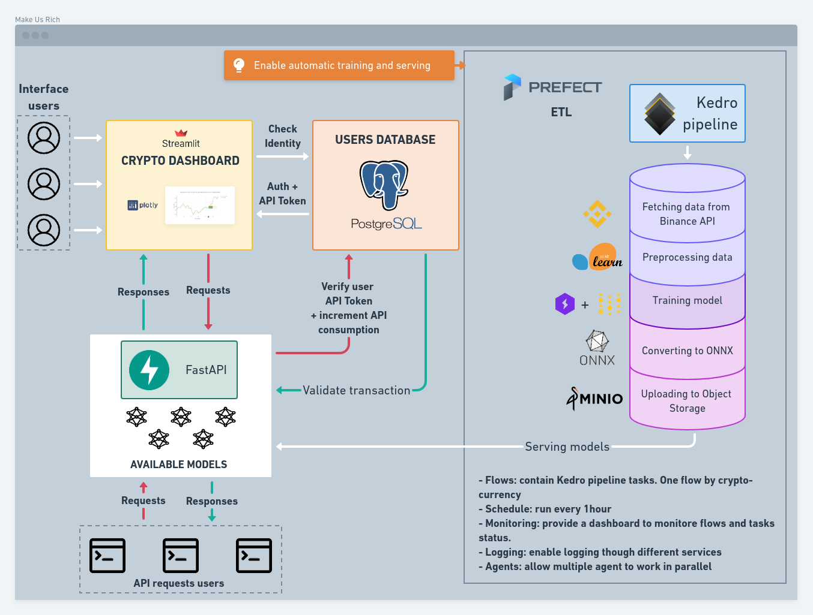

# Make Us Rich
Deep Learning applied to cryptocurrency forecasting. This project is a tool to help people to train, serve and use 
cryptocurrencies forecasting models. This project was build by @ChainYo to help people building their own MLOps 
projects.

For more details on how to use this project, please refer to [documentation](https://chainyo.github.io/make-us-rich/).
(🚧 Still in development)

You can inspect the training pipeline with the `Kedro Viz` tool, available [here](https://makeusrich-viz.chainyo.tech)

Here is the simplified project architecture:



---

## Installation

I recommend to install this package in an isolated environment. If you want to learn more about the recommended 
installation, check the [installation instructions](https://chainyo.github.io/make-us-rich/#installation).

```bash
pip install make-us-rich
```

## CLI Usage

Basic commands are: `mkrich init` and `mkrich run`. Check the 
[API documentation](https://chainyo.github.io/make-us-rich/api/cli/) related to the cli usage for more details.

## Support

If you encounter any problems using this project, please open an issue [here](https://github.com/ChainYo/make-us-rich/issues).

If you find this project usefull, please consider supporting by sharing the repo and giving a ⭐! 
