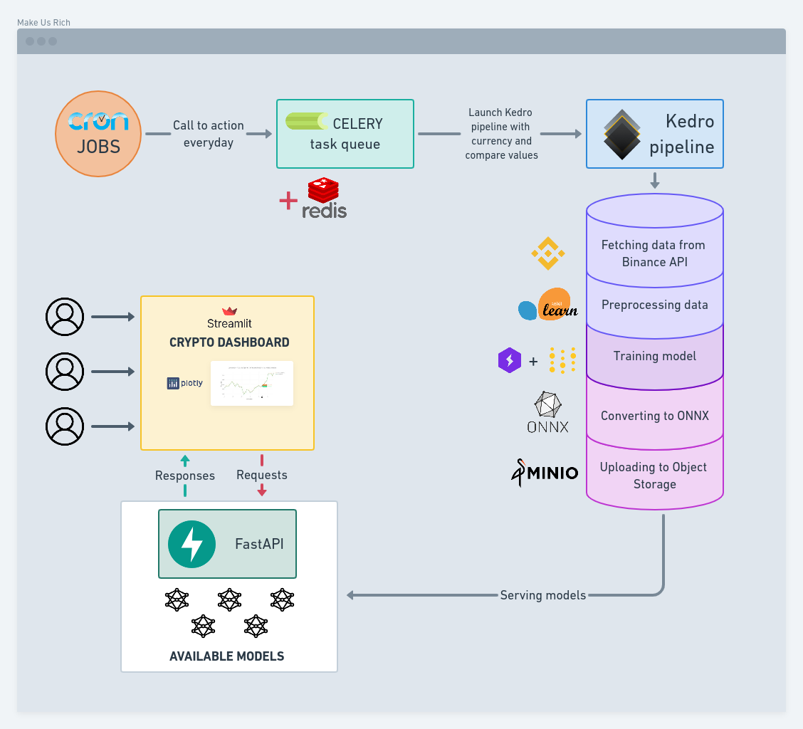

# 🚧 Be carefull this repo is still a work in progress

What is already functional?
- [ ] Prefect Flows - 80%
- [x] Training pipeline - 100%
- [x] Serving models - 100%
- [x] Interface - 100%
- [ ] Documentation - 0%

# Make Us Rich
Deep Learning applied to cryptocurrency forecasting.

For more details on how to use this project, please refer to [documentation](https://chainyo.github.io/make-us-rich/).

You can inspect the training pipeline with the `Kedro Viz` tool, available [here](https://makeusrich-viz.chainyo.tech)

---

## Introduction

We provide a simple way to train, serve and use cryptocurrency forecasting models on a daily basis.



Every day `cron` jobs send to `celery` workers the order to launch multiples training pipelines.
Each order contains 2 variables: `currency` and `compare` to identify which type of data the `fetching data` part
needs to get.

For example, if you want to train a model on the currency `Bitcoin` compared with `US Dollar` the `cron` jobs will give: `currency="btc",compare="usdt"`.

You have to give the symbol for each variable. Find all available symbols on the 
[Binance](https://www.binance.com/en/markets) platform.

One `celery` worker will launch a pipeline with these 2 values. Once the pipeline is
launched, everything works smoothly and automatically. 

There is 5 steps for the pipeline to complete:
- 🪙 Fetching data from Binance API.
- 🔨 Preprocessing data:
    - Extract features from fetched data.
    - Split extracted features.
    - Scale splitted features.
    - Create sequences with scaled train features.
    - Create sequences with scaled test features.
    - Split train sequences as train and validation sequences.
- 🏋️ Training model.
- 🔄 Converting model to ONNX format.
- 📁 Uploading converted model to object storage service.

After the end of the training pipeline, the new model will be loaded on the serving server where it could be consumed via API.

The final step is the crypto dashboard that allows users to see forecasting for their favorite assets.

---

## How it works

This is the project repository architecture:

```
📦src
 ┣ 📂interface
 ┃ ┗...
 ┣ 📂serving
 ┃ ┗...
 ┣ 📂trainer
 ┃ ┗...
 ┣ 📂viz
 ┃ ┗...
 ┗ 📂worker
   ┗...
```

You can clone the full repository and then navigate to the `src` folder to see the code. Each folder contains the code 
specific to that part of the project. Each part has its own README.md file and it's own requirements. Everything is
documented in the [documentation](https://chainyo.github.io/make-us-rich/).

The main project has `poetry` as package manager. If you need to install poetry, check their [documentation](https://python-poetry.org/docs/).